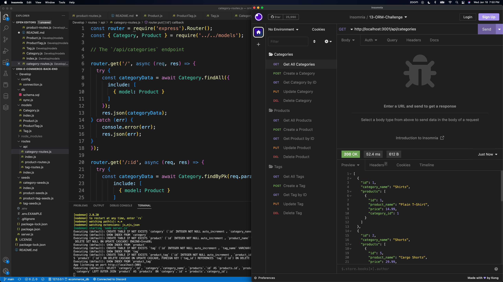

# ORM-E-Commerce-Back-End
  

  ## Description of Project
  Interact with your database through Insomnia like you never imagined! Organized to a T, you can find all tour products, categories, and tags while creating, updating, and deleting new ones of the same vein.

  ## Table of Contents
  - [Installation Instructions](#installation-instructions)
  - [License](#license)
  - [Visuals](#visuals)
  - [Questions](#questions)
   
  ## Installation Instructions
  npm i, insomnia, mysql2, nodemon
    
  ## License
  MIT

  ## Visuals
  

  ## Questions
  Please feel free to reach out to me directly at samfcraig@gmail.com, or you can find this project and others at my GitHub account, https://github.com/shmuushmuu.